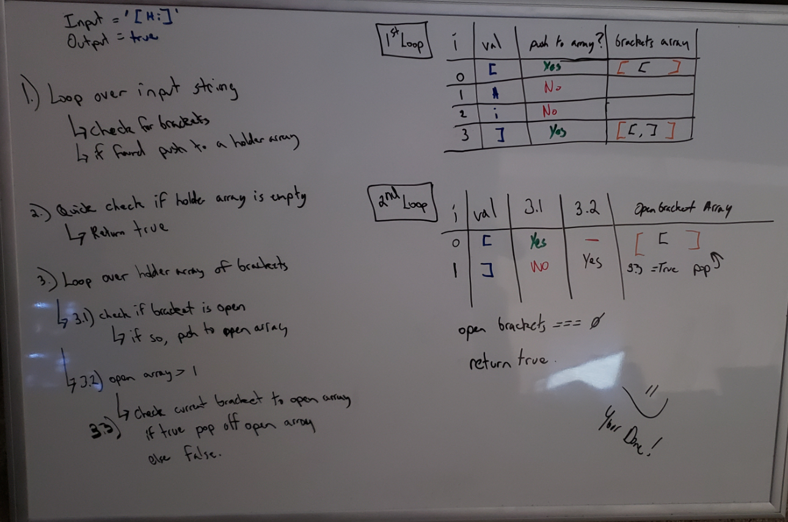

# Multi Bracket Validation
[Table of Contents](../../../README.md)

[Link to the Code](./multi-bracket-validation.js)

---

## Challenge 13
Multi-Bracket Validation is a challenge to verify that an inputed string has balanced brackets. It will return a boolean representing whether or not the brackets in the string are balanced. There are three types of brackets:
- Round Brackets: `()`
- Square Brackets: `[]`
- Curly Brackets: `{}`

---

## Approach & Efficiency
Within this function we are doing a couple loops with several logic statements. Overall the time complexity will be O(n). We are going to loop over the entire input to find brackets, and store them into a temp array. Space is O(n) as the entire string could be brackets. We then loop a second time over all brackets, doing some pushing and popping of brakets.

---

## Solution

