# Merge Sort
Merge Sort is a sorting algorithm that splits and incoming list in half, sorting the left and then sorting the right. After both are sorted, merge them back together.

Checkout official README: [README Link](./README.md)

---

## Pseudocode
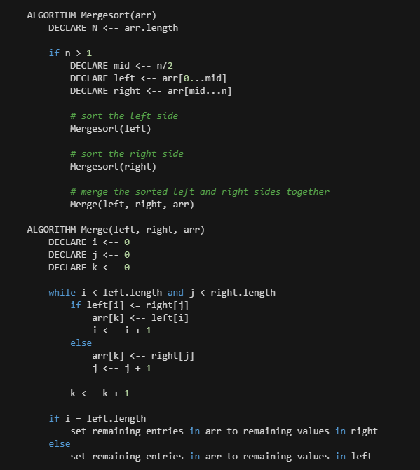

---

## Trace
 Sample Array: `[8,4,23,42,16,15]`

### Pass 1:
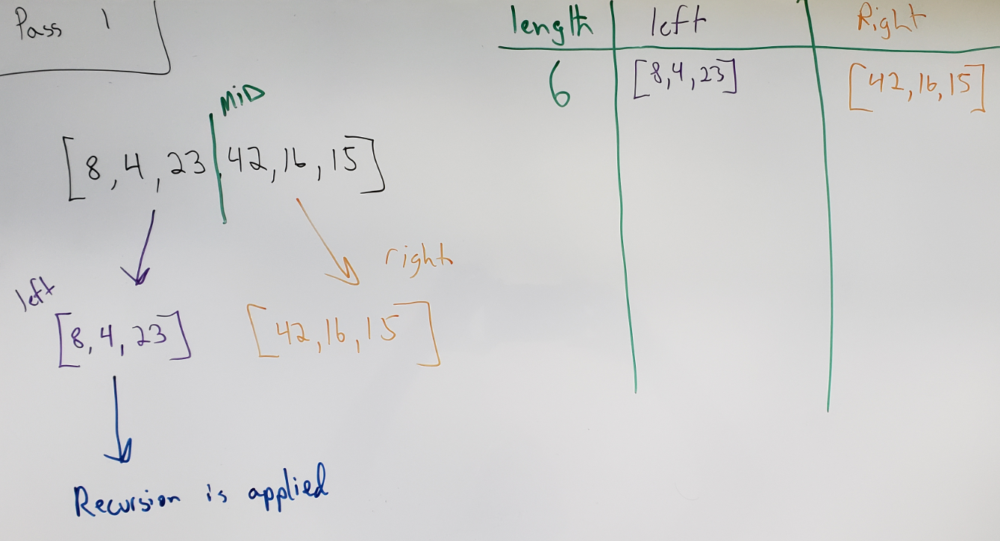

In the first pass, we are taking the original list and splitting it into two halves. After the initial split, we move on to the next part of the function which is recursively calling this function on the left half.

---

### Pass 2:

In the second pass, and first recursion, R1, we split the list again, and call a recursion on the left side, in this case left is 1, and that recursion call is complete. This will continue to the next line of code calling a recursion call on the right side.

---

### Pass 3:
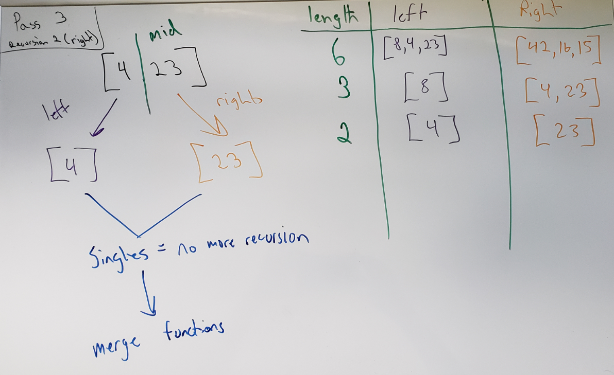
In pass three, recursion 2, R2, we split the list again resulting in two single item lists. The recursive functions of merge_sort(left) and merge_sort(right) are both called but since both have a length of 1, they complete immediately, moving on to the next line of code which is merge, merge the two lists based on value.

---

### Pass 4:
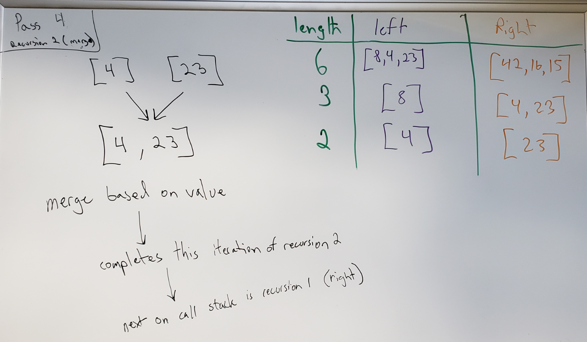
In pass 4, we are still in R2, on the final function which is merge. We are now merging the lists based on value, this completes an this recursion function and returns to the next function on the call stack, which is R1.

---

### Pass 5:
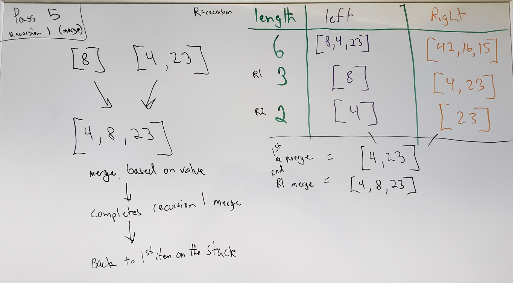
In pass 5, recursion 1, we have already completed the merge_sort(left) and merge_sort(right) and are moving into the merge. Based on value we merge the two lists. Completing recursion 1, moving back to the next function on the call stack which is the initial invocation of the merge_sort function.

### Pass 6:
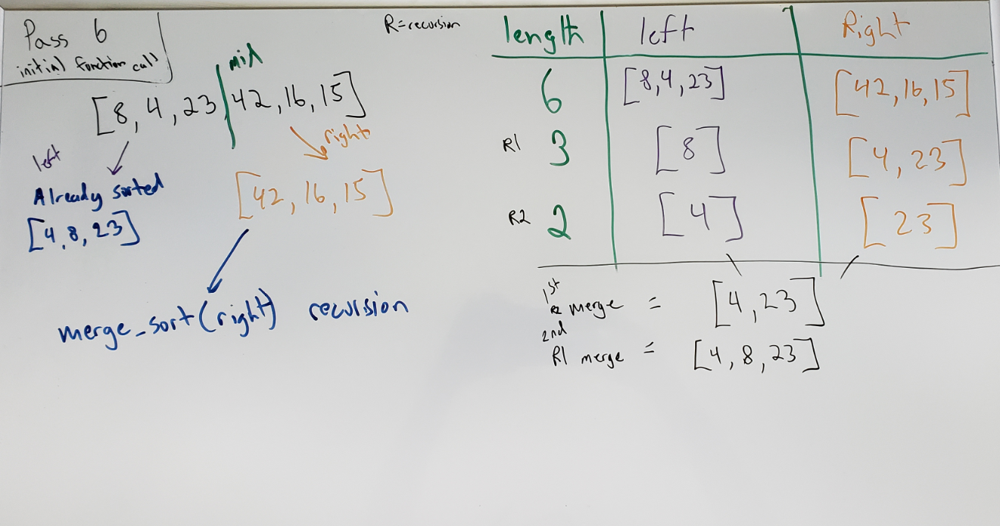
In pass 6, we are on the initial call of the function. Here we see what the original split of the list was, and we have completed the merge_sort(left) and are half sorted. Now we move onto the right half, merge_sort(right) which results in the same process of recursion.

### Pass 7:
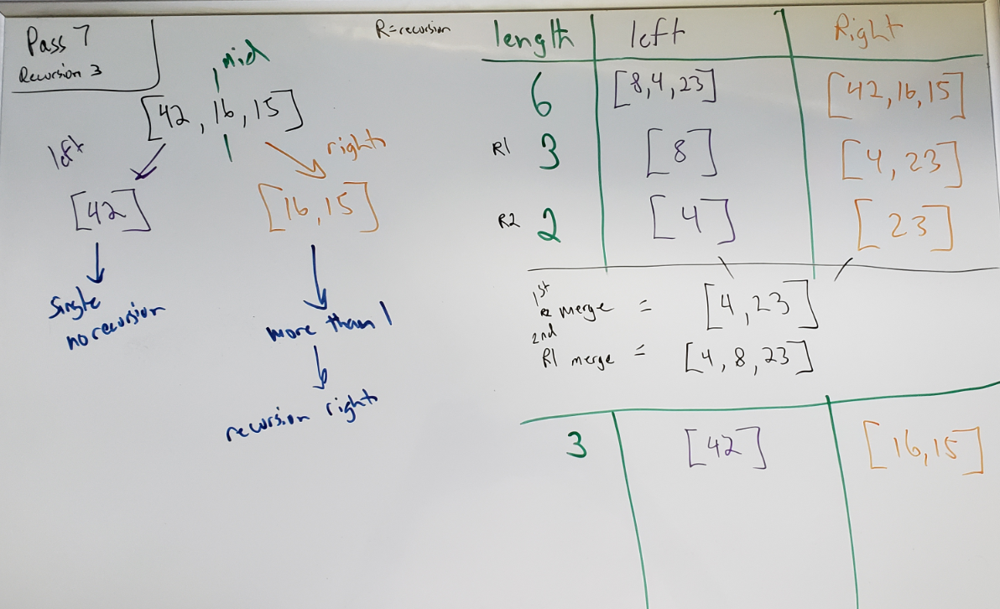
In pass 7, we enter recursion 3. We split the list into halves, noticing that left is a single item list, no recursion required, right is more than 1 in length so we will merge_sort(right) to split more.

### Pass 8:
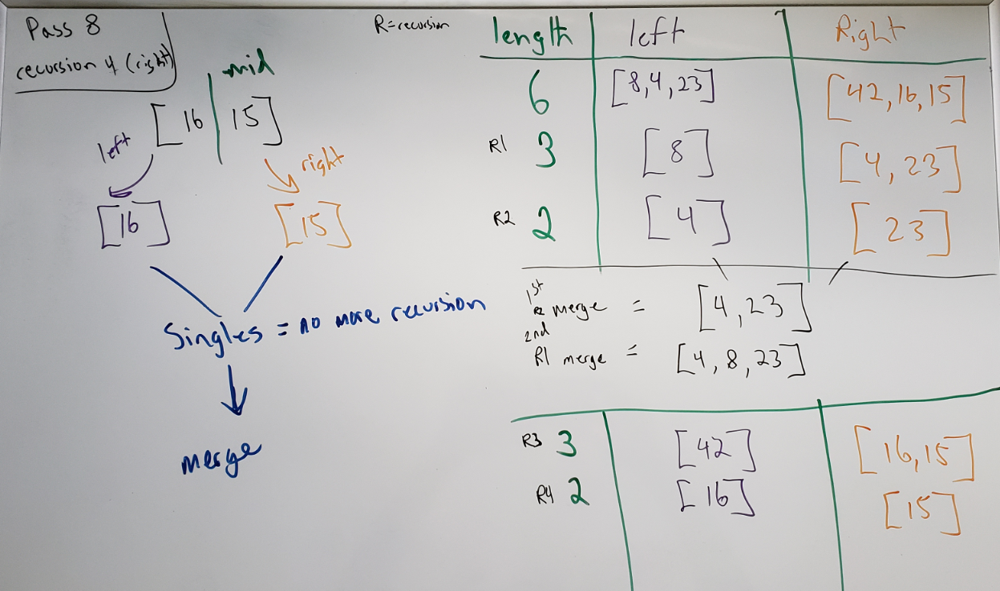
In pass 8, we enter recursion 4, splitting the right list down, to two single item lists which results in no more recursions and entering the merge function.

### Pass 9:
##### DISCLAIMER: Picture does not display correct pass, but this is pass 9
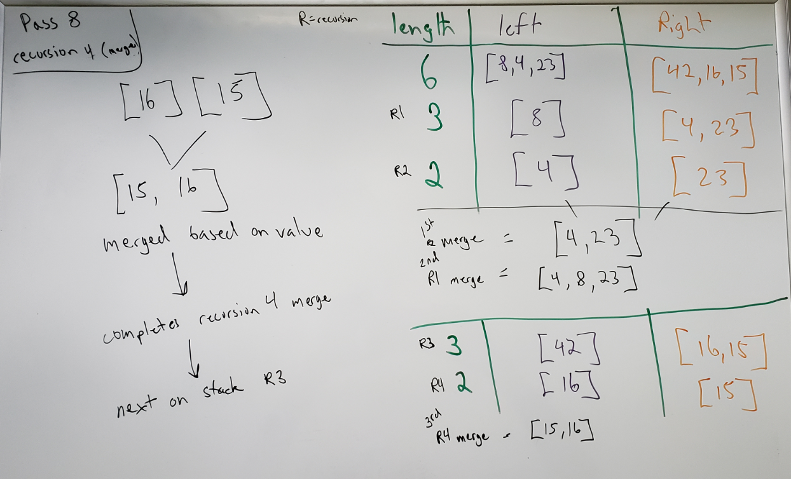
In pass 9, we are in recursion 4, R4, and have entered the merge function. We merged the lists based on value which results in completing the R4 function. We head back to the callstack to the next function which is the R3.

### Pass 10:
##### DISCLAIMER: Picture does not display correct pass, but this is pass 10
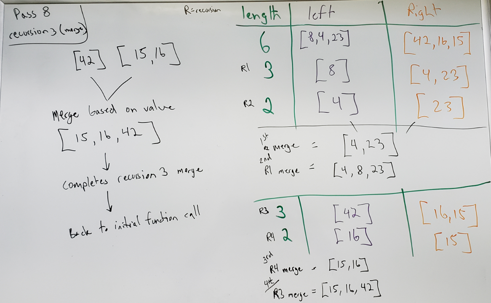
In pass 10, we are now complete with merge_sort(left) and merge_sort(right) and have entered the merge function. We are still in R3, and are merging the two halves based on value. Once complete this finishes this recursion and we return to the call stack. The last thing in the stack is the initial function call.

### Pass 11:
##### DISCLAIMER: Picture does not display correct pass, but this is pass 11
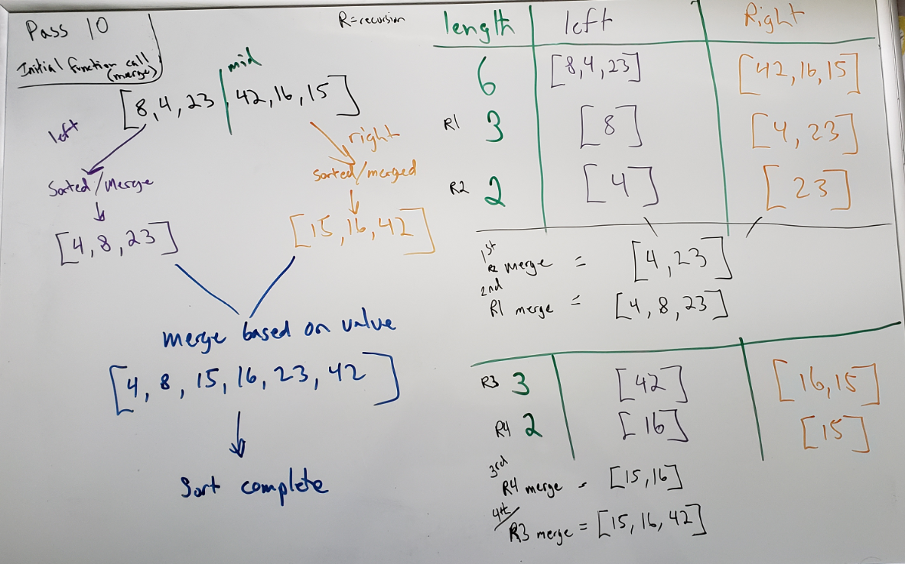
In the final pass, we have returned to the initial invocation of this function, which has now completed the sort of the left half and the right half. We move into the final piece which is the merge function, merging these two lists based on value. Resulting in a final list sorted.

---

## Efficency
* Time O(log(n))
    - The basic algorithm for Merge Sort is to split the list into two halves, and continuing to repeat this process until the lists become the length of 1. Then finally merge them back together based on value. Since this function is continually splitting the lists into half like a binary search tree, time is O(log(n))
* Space O(n)
    - Since this function is constantly splitting the list, making small lists of the original one but not adding too it. We remain with the same amount of space taken up, so a split of 6 items is two lists of 3. Space remains unchanged. With this logic, our overall space complexity is O(n) or however long the original list is.
