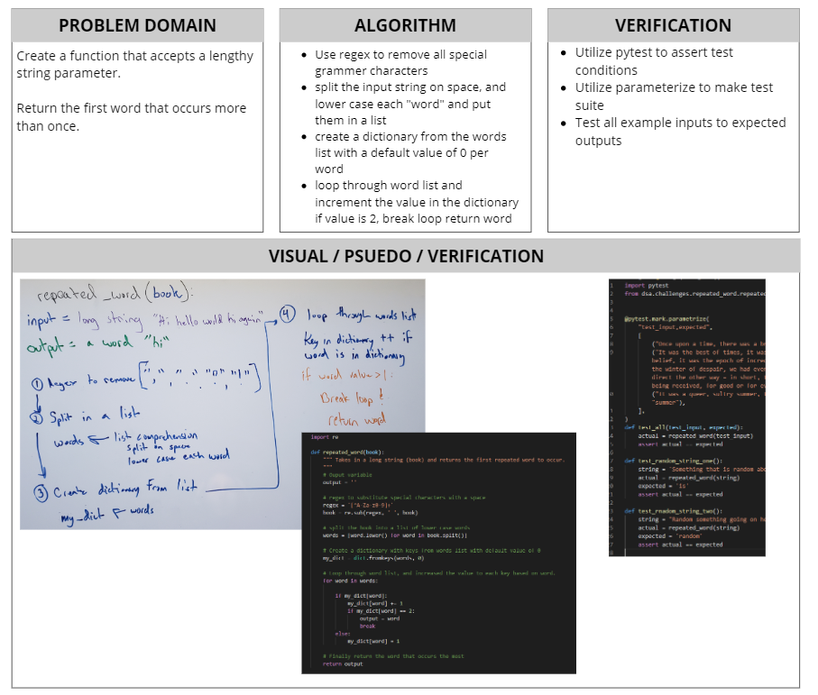

# Tree Intersection

[Table of Contents](../../../README.md)

[Link to the Code](./tree-intersection.js)

---

## Challenge 32
Find common values in two binary trees.

---

## Approach & Efficiency

---

## Solution

<!-- ; -->
