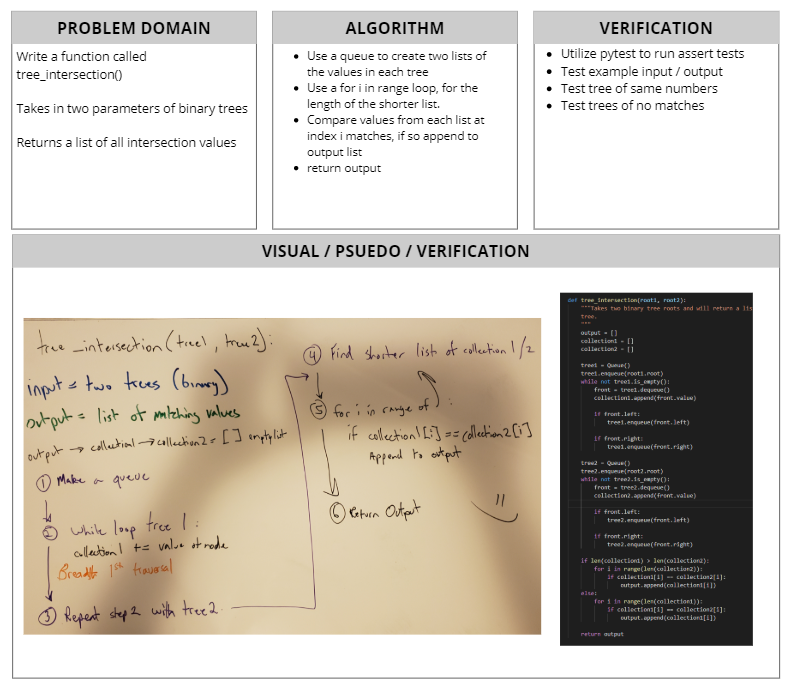

# Tree Intersection

[Table of Contents](../../../README.md)

[Link to the Code](./tree-intersection.js)

---

## Challenge 32
Find common values in two binary trees.

---

## Approach & Efficiency

The overall approach is probably not the best but is got the job done. This function creates three lists, an output and two temporary lists. The holder lists will be O(N) space dependent on the size of the given tree. I utilize a queue, to be able to travel using breadth first traversal. There are two while loops, O(n) per tree, they loop through the tree appending the values to each holder list. After the lists are built, we then use a for loop O(n), n being the lenght of the shorter list. Comparing if the values are the same at the given index. If so we append to an output list and return it.

---

## Solution

;
