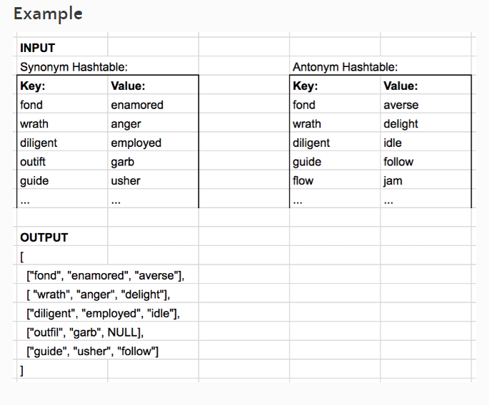
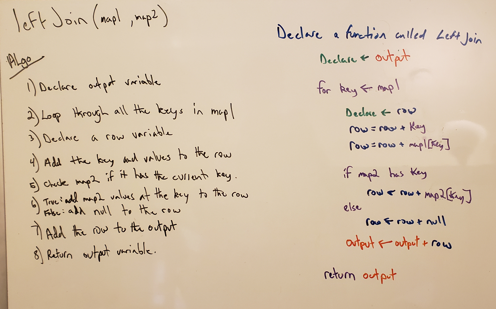

# Left Join

[Table of Contents](../../../README.md)

[Link to the Code](./left-join.js)

---

## Challenge 33

Implement a simplified LEFT JOIN for 2 Hashmaps.

---

## Examples

## Approach & Efficiency
The way I built this function was take in the two hash maps and we know all the keys in the first hashmap is the ones that are staying, and the ones in the left are merging over. So I choose to loop over all the keys in hashmap1. During this loop, we will create a row list, we will append the key of the hash map, followed by the value from hashmap1. Then we search the second hashmap with the key from hashmap1, this is an o1 lookup time if there were no collisions in the hashmap. If a value is found for that given key in hashmap2, we append that to our row list. After both hashmaps have been looked at, we take that holder row list and append it to our output list. A list of lists.

O(n) time given the length of the left hashmap, and O(n) space based on the number of keys in left hashmap.

---

## Solution

