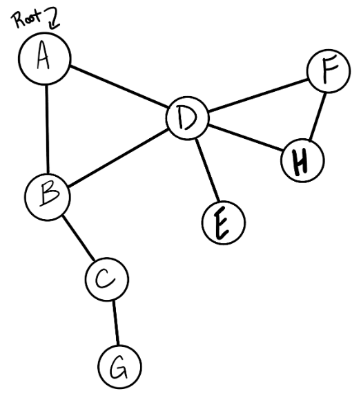
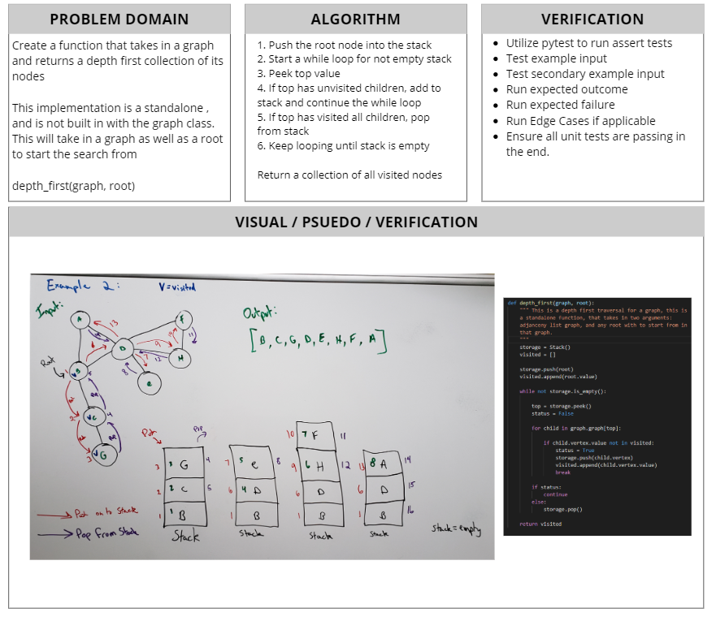

# Depth First with Graphs
[Table of Contents](../../../README.md)

## Challenge 38

Conduct a depth first preorder traversal on a graph

## Features
- [x] Create a function that accepts an adjacency list as a graph, and conducts a depth first traversal. Without utilizing any of the built-in methods available to your language, return a collection of nodes in their pre-order depth-first traversal order.

## Examples

`Graph`

Output: `[A, B, C, G, D, E, H, F]`

---
## Approach & Efficiency

This depth first traversal, utilizing a stack to visit each node in the graph. Since we are creating a stack, we are creating additional space. We make use of appending and pushing, this are both just O(1) operations to the end of lists. Same with poping from the stack. We have a while loop and a for loop. The time complexity, is O(N) based on the number of nodes inside the graph, and O(N) remains based on connections

NOTE:

This can be built as a method on the graph class, then this depth_first would only take in one argument, a root. It would get graph from the "self".

---

## Solution
;
