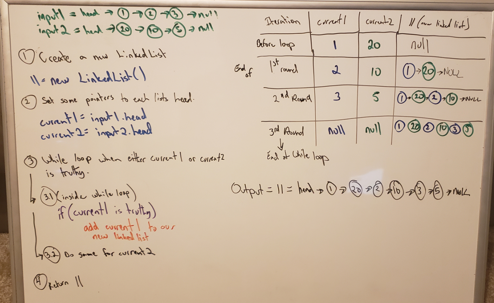

# Linked List kth from the end

[Table of Contents](../../../README.md)

[Link to the Code](./linked-list.js)

## Challenge 08
Extending the `LinkedList` class from challenge 07. Added a new method:
- `zipLists`: Takes in two linked lists as arguments. Zip them together into one so that the nodes alternate between the two lists and return a referent to the head of the zipped list.

---

### Example:

- `ll.zipLists(k)`:

| Arg `list1` | Arg `list2` | Output |
| ----- | ------ | ------ |
| `head -> [1] -> [3] -> [2] -> X` | `head -> [5] -> [9] -> [4] -> X` | `head -> [1] -> [5] -> [3] -> [9] -> [2] -> [4] -> X` |
| `head -> [1] -> [3] -> [2] -> X` | `head -> [0] -> [4] -> [5] -> X` | `3` | `head -> [1] -> [0] -> [3] -> [4] -> [2] -> [5] -> X`
| `head -> [1] -> [3] -> [2] -> X` | `head -> [5] -> [9] -> X` | `head -> [1] -> [5] -> [3] -> [9] -> [2] -> X` |

---

## Approach and Efficiency
For this challenge I created a brand new linked list. This will take in the values from both input lists and return a single linked list. We are using a while loop to accomplish this task, our Time is O(n) as we will loop over N times dependant on the length of list1 + list2. Space is O(n) with the same dependencies as Time.

---

## Solution

