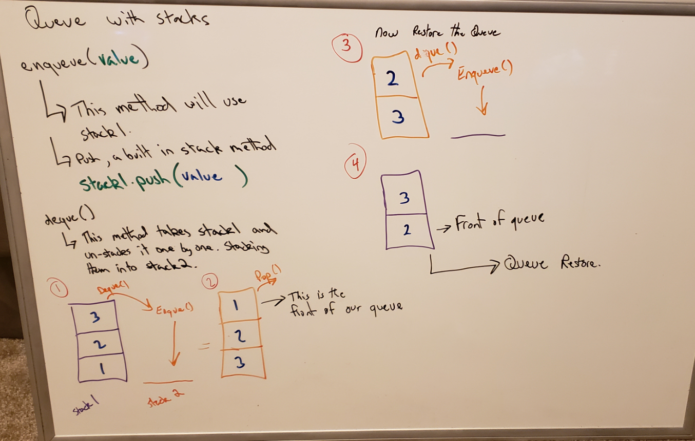

# Queue With Stacks
[Table of Contents](../../../README.md)

[Link to the Code](./queue-with-stacks.js)

---

## Challenge 11

This challenge is about creating a PseudoQueue class. Instead of using the original Queue class, we will implement the standard queue interface but internally it will utilize two Stacks.

---
### Example:
`enqueue(value)`
|Input|Args|Output|
|:-----|:-----:|-----:|
|`[10]->[15]->[20]`|`5`|`[5]->[10]->[15]->[20]`|
|`empty queue`|`5`|`[5]`

`dequeue()`
|Input|Output|Internal State|
|:-----|:-----:|-----:|
|`[5]->[10]->[15]->[20]	`|`20`|`[5]->[10]->[15])`|
|`[5]->[10]->[15]`|`15`|`[5]->[10]`

---

## Approach & Efficiency
This is not the best solution for managing a queue. Utilizing two stacks to "slinking" between in order to maintain the First-In-First-Out is a Big-O Nightmare. I had to utilize a while loop, to iterate over the first stack to retreive the bottom, or first out node. Then reverse the process to return the stack back to normal so any additional items added to the queue were after those already placed in queue.

---

## Solution

