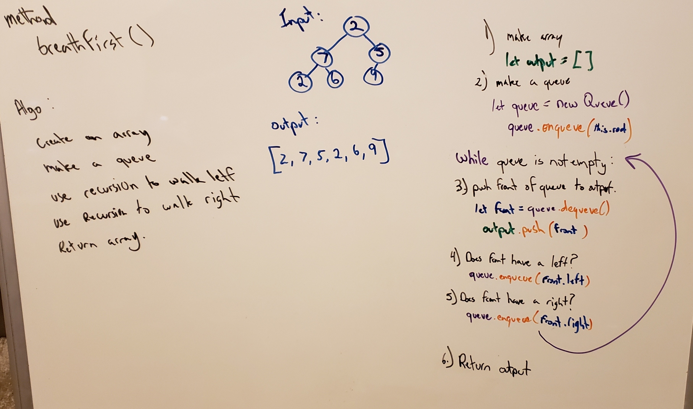

# Trees
[Table of Contents](../../../README.md)

[Link to the Code](./breadth-first.js)

---

## Challenge 17
Write a breadth first traversal method which takes a Binary Tree as its unique input.

---

## Approach & Efficiency
To accomplish this type of traversal , we are utilizing a queue to keep track of the nodes. This will add each node at each level throughout the tree. O(n) Time complexity, plus recursion I am not sure what that might be. O(h) space this is directly related to the height of the tree, we are adding h functions to the call stack taking up h space.

---

## Solution

