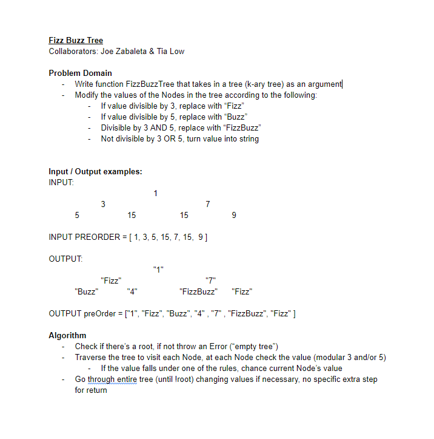
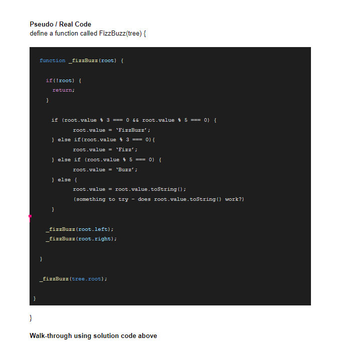

# Trees
[Table of Contents](../../../README.md)

[Link to the Code](./breadth-first.js)

---

## Challenge 18
Write a stand alone function called `FizzBuzzTree` which takes in k-ary tree as an argument. Follow the following FizzBuzz rules, and modify the tree in place.
- If the value is divisible by 3, replace the value with “Fizz”
- If the value is divisible by 5, replace the value with “Buzz”
- If the value is divisible by 3 and 5, replace the value with “FizzBuzz”
- If the value is not divisible by 3 or 5, simply turn the number into a String.

---

## Approach & Efficiency
This approach takes on the form of recursion. The big O calculated for time is O(n) at a minimum we must visit each node and its value. Space O(1) we do not create any new nodes or new values. We just reassign variables as we go.

---

## Solution

